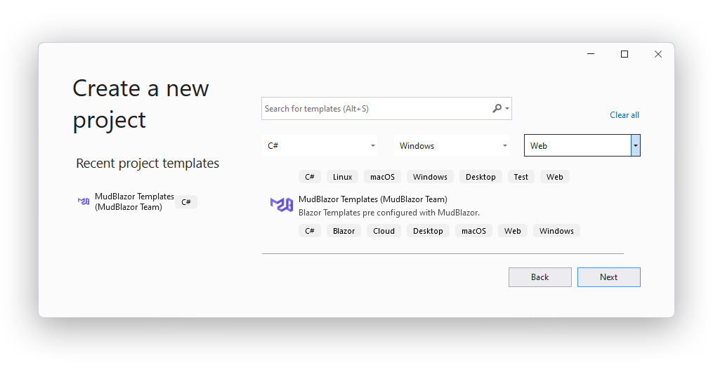
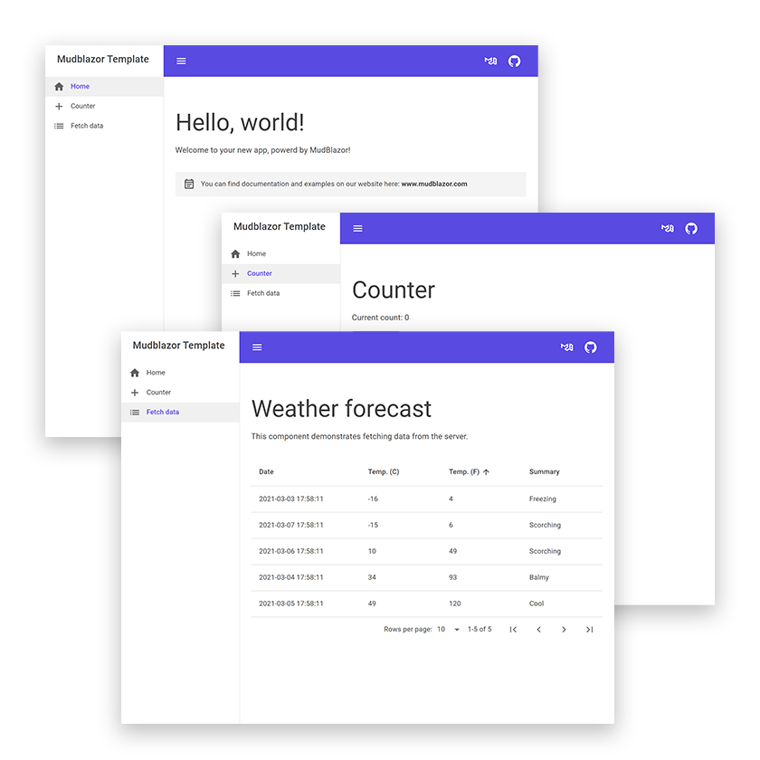

# 
# Blazor Template pre configured with MudBlazor.

[](https://github.com/Garderoben/MudBlazor.Templates/blob/master/LICENSE)
[](https://discord.gg/mudblazor)
[](https://twitter.com/MudBlazor)
[](https://www.nuget.org/packages/MudBlazor.Templates/)
[](https://www.nuget.org/packages/MudBlazor.Templates/)

## Prerequisites

- .NET 6
- Visual Studio 2022, JetBrains Rider or VsCode 

## Getting Started
### Installation
```
dotnet new install MudBlazor.Templates
```
### Usage
```
dotnet new mudblazor --host wasm --name MyApplication
```
### Template Options
Specific template options:
| Options                 | Description                                           | Type                                                                         | Default   |
|-------------------------|-------------------------------------------------------|------------------------------------------------------------------------------|-----------|
| `-ho` \| `--host`       | Project Type                                          | `wasm` \| `wasm-hosted`<br> `wasm-pwa` \| `wasm-pwa-hosted`<br> `server`<br> | `wasm`    |
| `-s` \| `--skipRestore` | Skips the automatic restore of the project on create. | `bool`                                                                       | `false`   |

For none MudBlazor specific options run:
```
dotnet new -h
```

# New Web App Template for .NET 8

MudBlazor Web App template copied from Microsoft Web App template and modified to use MudBlazor components.
Requires .NET 8 latest SDK to be installed.
Requires latest Visual Studio 2022 Preview to be seen in the list of templates.
install the latest MudBlazor.Templates from NuGet to get the template.

## Tested Modes for new .NET 8 Web App Template

### Interactive per Page:

``` 
dotnet new mudblazorwebapp -int (Auto|Server|WebAssembly)
```

### Interactive Global:

```
dotnet new mudblazorwebapp -int (Auto|Server|WebAssembly) -ai
```

### Add Authentication:

```
dotnet new mudblazorwebapp -int Auto -au Individual
```

## ToDo for the .NET 8 Template:
* Authentication not yet using MudBlazor components, need to be updated.
* Add more meaningful demo pages with actual fetching of data from server.
* Add more documentation on how to use the template.
* Currently Authentication is only working without the -ai option, need to fix that.

### Visual Studio Templates
The templates can be used in Visual Studio as well and should show up in the list when creating a new project.


## Default Blazor - Template

